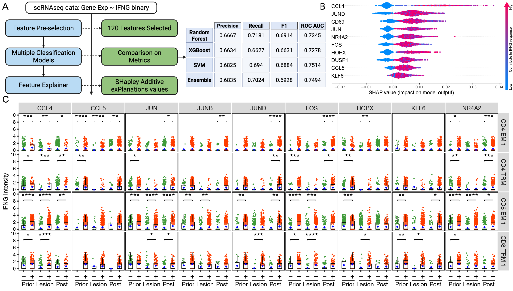

## How to leverage ML to investigate the mechanism of T cell dysfunction. 

This discussion forms part of the manuscript of **Deep Immune Profiling of HSV-2 Reactivated Skin Biopsies** (submission comes soon), where immune profiling revealed intricate factors driving T cell responsiveness. 

To dissect the molecular underpinnings of T cell dysfunction during HSV reactivation, I harnessed machine learning methodologies, using IFN-γ expression as a surrogate marker of T cell functionality.

---

### **Core Objective**

This methodological exploration emphasizes the development and optimization of ML models to identify key determinants of IFN-γ responses in T cells, leveraging scRNA-seq data. My focus extended to comparing sampling strategies to tackle class imbalances, an often-overlooked challenge in computational biology.

---

### **Key Challenges**

A significant challenge stemmed from the highly imbalanced distribution of IFN-γ positive (IFNG+) and IFN-γ negative (IFNG-) cells across T cell subsets includes (conventional effector memory T cells, central memory T cells, ISG+ T cells, proliferating T cells, and tissue-resident memory T cells).

For example, in activated CD4+ T cells, we observed **552 IFNG- cells** compared to only **47 IFNG+ cells**, representing a 10:1 class imbalance. This disparity was even more pronounced in other T cell clusters. Left unaddressed, this imbalance severely impaired model performance, particularly precision and recall metrics, resulting in high false-negative rates. While ROC-AUC curves provided an overall measure of performance, **precision-recall curves** were more informative in evaluating classification under such imbalanced conditions.

| CellType_Level3 | CD4 Act | CD4 CM | CD4 EM 1 | CD4 EM 2 | CD4 EM 3 | CD4 ISG | CD4 Prolif | CD4 TRM | CD8 CM | CD8 EM 1 | CD8 EM 2 | CD8 ISG | CD8 TRM 1 | CD8 TRM 2 |
|-----------------|---------|--------|----------|----------|----------|---------|------------|---------|--------|----------|----------|---------|----------|----------|
| IFNG_bin = 0    | 552     | 1439   | 2086     | 2005     | 1338     | 864     | 635        | 824     | 1795   | 1585     | 1253     | 325     | 402      | 1272     |
| IFNG_bin = 1    | 47      | 73     | 330      | 63       | 65       | 106     | 161        | 296     | 114    | 728      | 190      | 110     | 261      | 224      |

---

### **Key Solutions**

To mitigate the effects of class imbalance, we explored two complementary strategies: **oversampling** and **undersampling**.

#### **1. Oversampling Strategy**
- Applied **SMOTE** and **SMOTE-Borderline** techniques.
- SMOTE-Borderline exhibited marginal recall improvements over standard SMOTE.
- Pre-selected features using **LASSO-penalized GLM** before oversampling, yielding slightly better recall metrics.
- Despite these adjustments, overall performance remained suboptimal, with recall values below 0.2 in most models.

#### **2. Undersampling Strategy**
- Matched sample sizes to the minority class for each T cell subset.
- Achieved substantial improvements in balanced metrics, including precision, recall, and F1 score.
- Evaluated various ML models:
  - **Random Forest** delivered superior recall.
  - **SVM** showed better precision and ROC-AUC.
- Combined models in a stacking ensemble, resulting in the following performance metrics:
  - **Precision:** 0.68  
  - **Recall:** 0.70  
  - **F1 Score:** 0.60  
  - **ROC-AUC:** 0.75  

The ensemble approach significantly outperformed baseline and oversampling methods, which typically achieved recall values between 0.05 and 0.20.

---

#### **Performance Comparison**

| Strategy                         | Model           | Precision | Recall  | F1 Score | ROC-AUC |
|----------------------------------|-----------------|-----------|---------|----------|---------|
| **No Resampling**                | Random Forest   | 0.7111    | 0.1157  | 0.199    | 0.7996  |
|                                  | XGBoost         | 0.6520    | 0.2145  | 0.199    | 0.8053  |
|                                  | SVM             | 0.0000    | 0.0000  | 0.1999   | 0.7836  |
| **Down Sampling**                | Random Forest   | 0.6667    | 0.7181  | 0.6914   | 0.7345  |
|                                  | XGBoost         | 0.6634    | 0.6627  | 0.6914   | 0.7278  |
|                                  | SVM             | 0.6825    | 0.6940  | 0.6914   | 0.7514  |
|                                  | Stacked         | 0.6835    | 0.7024  | 0.6928   | 0.7494  |
| **Over Sampling on All Features**| Random Forest   | 0.3980    | 0.0400  | 0.0800   | 0.7544  |
|                                  | XGBoost         | 0.5385    | 0.1687  | 0.0841   | 0.7738  |
| **Over Sampling on Selected Features** | Random Forest | 0.4767 | 0.1976  | 0.2794   | 0.7957  |
|                                  | XGBoost         | 0.5217    | 0.2313  | 0.2794   | 0.8032  |

---

By leveraging advanced ML approaches and carefully addressing sample imbalances, our analysis provided novel insights into the mechanisms underlying T cell dysfunction, laying the groundwork for future therapeutic strategies.